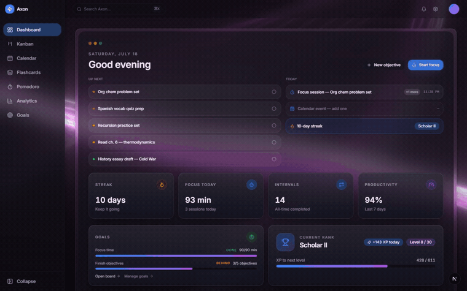

# Axon

A **local-first study productivity dashboard** for students who struggle with distraction and consistency — with optional **Supabase auth + sync**, dark/light themes, Focus Mode, and gamified unlockable backgrounds.

> **Live Demo:** _Not yet deployed._ Once hosted (e.g. on Vercel), add the link here: `https://your-deployment-url.vercel.app`

---

## Demo



A quick tour of every feature page, cut together from real interactions — a kanban drag, calendar tab switches, a focus-mode timer, a flashcard flip, a chart hover — with match-style cuts, whip-pan and speed-ramp transitions, and captions. Higher-quality video: [`docs/demo/axon-demo.mp4`](docs/demo/axon-demo.mp4). Re-run with `npm run demo:cinematic` (records fresh footage against a local dev server, then edits it with ffmpeg).

---

## Key Features

* **Dashboard:** Today agenda, up-next queue, streak/XP, personalized “Good morning, {name}” greetings, unlockable ambient backgrounds as you rank up.
* **Kanban:** Objectives with drag-and-drop, priorities, recycle bin, Advanced recurrence/dependencies.
* **Calendar:** Month/week/day scheduling + agenda panel.
* **Pomodoro + Focus Mode:** Multi-timers, session summaries, lockdown overlay with exit confirmation.
* **Flashcards:** Set grid by default, optional visual gallery, 2D study flip cards.
* **Analytics:** High-signal charts (focus trend, completion, streak heatmap) + optional deeper insights.
* **Goals:** Seeded study goals **plus** personal open-ended daily/weekly goals you track manually.
* **Auth:** Dedicated [`/login`](src/app/login) page (homepage Login button wired). Optional Google / email via Supabase. Offline works without an account.
* **Themes:** Dark and light modes in Settings.
* **Legal:** [`/terms`](src/app/terms) and [`/privacy`](src/app/privacy).
* **Security:** Rate-limited auth APIs, input sanitization, RLS on cloud tables — see [`docs/security-audit.md`](docs/security-audit.md).

---

## Tech Stack

- **Next.js 15** (App Router) · **React 18** · **TypeScript**
- **Tailwind CSS v4** · Radix UI · Framer Motion · GSAP / Lenis
- **Supabase** (optional auth + sync) · **Recharts** · **dnd-kit**
- **OGL / Three.js** ambient effects · React Bits–style backgrounds (registry in `components.json`)

---

## Getting Started

### Prerequisites

- Node.js `v18.17+` and npm `v9+`

### Install

```bash
git clone https://github.com/<your-username>/axon.git
cd axon
npm install
```

### Environment variables

Copy [`.env.example`](.env.example) to `.env.local` for optional cloud sync:

```env
NEXT_PUBLIC_SUPABASE_URL=https://YOUR_PROJECT_REF.supabase.co
NEXT_PUBLIC_SUPABASE_ANON_KEY=your-anon-key-here
```

- The **anon key is public by design** (browser clients). Never put the **service role** key in `NEXT_PUBLIC_*` or commit `.env.local` (gitignored).
- Without these vars the app still runs fully offline.
- Schema + RLS: [`supabase/schema.sql`](supabase/schema.sql) and [`docs/supabase-setup.md`](docs/supabase-setup.md).

### Run

```bash
npm run dev
```

Visit [http://localhost:3000](http://localhost:3000). Use **Login** (top right) → `/login`, or open the dashboard without signing in.

---

## Core workflows

1. **Login / signup** — create an account with a display name for greetings; or stay local-only.
2. **Dashboard** — Today agenda + personalized greeting; unlock backgrounds in Settings as you level up.
3. **Kanban → Pomodoro** — plan objectives, start Focus Mode, finish with a session summary.
4. **Goals** — edit study targets or add personal daily/weekly goals (+1 progress).
5. **Settings** — theme, backgrounds, Focus Mode, privacy links, replay feature tips (one-time tips reappear inline as you revisit each page).

---

## Architecture

- `src/app` — routes (`/`, `/login`, `/terms`, `/privacy`, `(app)/*`, `api/auth/*`)
- `src/components` — UI, layout, landing, features, auth
- `src/hooks` — domain hooks on `use-local-storage`
- `src/lib/security` — rate limit + sanitize helpers
- `src/lib/backgrounds` — unlock catalog
- `docs/security-audit.md` — latest security review

---

## Project status

- [x] Local-first core (Kanban, Calendar, Flashcards, Pomodoro, Analytics, Goals, XP)
- [x] Focus Mode + session summary + per-page onboarding tips
- [x] Dedicated Rank/Progress page with the full level ladder
- [x] Optional Supabase auth/sync with RLS
- [x] Login page, dark/light theme, personal goals, unlockable backgrounds
- [x] Terms, Privacy, security hardening (rate limits, sanitization, audit doc)

### Exploring next

- [ ] Data import/export (JSON backup)
- [ ] Edge/KV-backed rate limiting for multi-region deploys
- [ ] Account deletion self-serve flow

---

## Contributing

Issues and PRs welcome. Read [`docs/security-audit.md`](docs/security-audit.md) before changing auth or sync paths.
