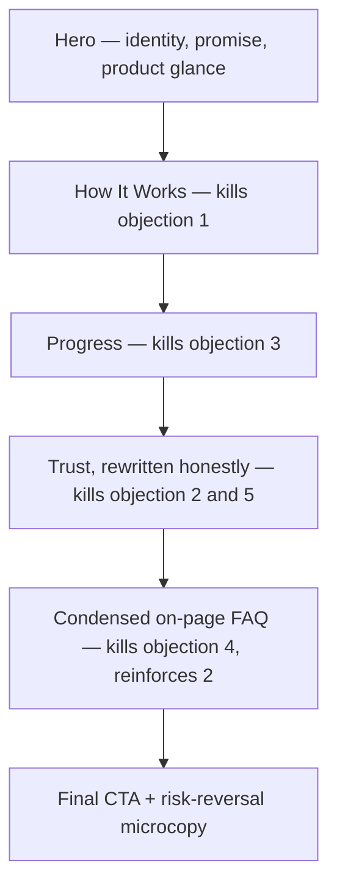

# Axon Landing Page — Design Audit & Specification

**Status:** Source of truth for the landing page revision described below.
**Scope:** `src/app/page.tsx` and `src/components/landing/*`, plus `src/app/faq/*`.

## Context that changes the verdict

This is not a green-field homepage. Git history (`a98f683 dark mode sweep`, `a95697b fixing aesthetics, reduced dullness`, `3df46a7 polished homepage`, `633b33a soft launch ready`) shows the page already went through several deliberate craft passes. The token system in [src/app/globals.css](../src/app/globals.css), the motion system in [src/lib/motion.ts](../src/lib/motion.ts), and the shared primitives in [src/components/landing/landing-primitives.tsx](../src/components/landing/landing-primitives.tsx) are **already premium-grade** — consistent spacing scale, one easing curve, tokenized shadows/radii, a real product-chrome motif reused everywhere. This audit does not recommend a rebuild. It recommends a **surgical, high-craft revision**: fix a cross-cutting copy-accuracy bug, fix two real UX gaps, and sharpen visual rhythm — while preserving the system that's already working.

The single most important finding: commit `cc60fad "acc now required to use dashboard"` made an account mandatory to reach `/dashboard` (added [src/components/auth/require-auth.tsx](../src/components/auth/require-auth.tsx)), but the marketing copy was never fully reconciled with this. The homepage still says "Works offline. Syncs when you want." in three places while the product now requires sign-up before anyone sees it work at all.

---

## PHASE 1 — Section-by-section audit

**Nav** — [src/components/landing/landing-nav.tsx](../src/components/landing/landing-nav.tsx)
- Purpose: wayfinding + conversion (Sign in / Get started). Necessary, well-executed scroll-spy for in-page anchors.
- **Critical gap**: nav links are `hidden md:flex` with **no mobile menu/hamburger at all**. Below `md` (768px), "How it works", "Progress", "Principles", "FAQ" are completely unreachable except by scrolling. This is a real accessibility/UX bug, not a style nit.
- FAQ is a real page (`/faq`) while the other three are anchor scrolls — a mixed navigation model. Reasonable if FAQ earns a standalone page; questionable given it currently holds only 4 questions (see FAQ section below).

**Hero** — [src/components/landing/hero.tsx](../src/components/landing/hero.tsx)
- Purpose: identity, single promise, primary CTA, first product glance. Composition is genuinely strong: one focal point, restrained atmospheric wash (no gradient theater), staggered entrance pulled from the shared motion tokens.
- **Content bug**: "A quiet command center for studying... Works offline. Syncs when you want." directly contradicts the now-mandatory account requirement. This is the copy's core promise, and it's inaccurate.
- No risk-reversal microcopy under the CTA ("free", "no credit card", "60 seconds") — exactly the spot this belongs, especially now that account creation is a hard gate rather than optional.
- `DashboardPreview` (in [dashboard-preview.tsx](../src/components/landing/dashboard-preview.tsx)) shows only the Dashboard view; breadth (Kanban/Calendar/Pomodoro/Flashcards) is revealed progressively in How It Works — this is correct sequencing, not a flaw.

**How It Works** — [how-it-works.tsx](../src/components/landing/how-it-works.tsx) + [how-it-works-visuals.tsx](../src/components/landing/how-it-works-visuals.tsx)
- Purpose: prove the core loop (Capture → Schedule → Focus → Review) with real-component-fidelity mockups (actual `TimerRing`, `ProgressBar`, `priorityDotClass`). This is the strongest, most product-first section on the page. Keep the interaction model (click-to-select tab list, roving arrow-key nav, `aria-expanded`/`aria-controls`) — it's correctly built.
- **Mobile-specific bug**: desktop uses a `1.15fr_0.85fr` grid (visual left, steps right). On mobile it just stacks — the shared visual sits *above* all four step rows. Tapping step 3 or 4 changes a visual the user has already scrolled past, with no visible feedback unless they scroll back up. The click→visual-update connection, which is the whole point of this section, breaks on the breakpoint most visitors will actually use.

**Progress** — [progress-motivation.tsx](../src/components/landing/progress-motivation.tsx)
- Purpose: prove gamification is earned from real activity, not vanity ("Tracked from real focus days, not check-ins"). Good, honest positioning; reuses real `StreakFlame`/`ProgressBar` components.
- Layout: eyebrow/heading/lead + a vertical 3-item icon list, paired with a `ProductChrome` panel.

**Trust ("Principles")** — [trust.tsx](../src/components/landing/trust.tsx)
- Purpose: values differentiation (offline-first, optional sync, deep work, no notification theater).
- **Same content bug, worse**: principle 01 is literally titled "Offline-first" with copy "Your workspace lives on the device... start without waiting on a network" — the most direct restatement of the now-false claim, in a section whose entire job is to build trust. Shipping this without a rewrite means the "trust" section actively erodes trust for anyone who signs up and hits the auth wall.
- **Rhythm problem**: this is a numbered 01/02/03 grid of icon+text items, immediately following Progress's vertical 3-item icon list. Two consecutive "list of 3 things" sections with no visual differentiation — the page's visual rhythm goes text→visual (HowItWorks) → text-list → text-list → CTA, which flattens right when it should be building toward the close.

**Final CTA** — [final-cta.tsx](../src/components/landing/final-cta.tsx)
- Purpose: closing conversion moment. Correctly restrained: one heading, one CTA, one soft accent glow, no competing elements.
- Missing the same risk-reversal microcopy as Hero — the highest-intent moment on the page and it still asks for a leap of faith with zero reassurance.

**Footer** — [footer.tsx](../src/components/landing/footer.tsx)
- Solid 3-column pattern, correct token usage throughout. Tagline repeats the same offline/optional-sync inaccuracy ("Offline by default. Sync when you want.") and the bottom bar repeats it again ("Free account · optional cloud sync"). Three independent copy sites carrying the same now-false claim confirms this needs a deliberate audit pass, not a one-line fix.

**FAQ route** — [src/app/faq/page.tsx](../src/app/faq/page.tsx) + [faq.tsx](../src/components/landing/faq.tsx)
- **Off-system**: uses raw `bg-black`, `text-white`, `text-white/55`, `border-white/10` instead of the token system (`bg-background`, `text-foreground`, `border-border`) every other page migrated to. This is the one page the "dark mode sweep" commit missed — a visible seam in an otherwise cohesive system.
- Content is thin (4 Q&As) but, notably, already accurate: "Do I need an account? Yes." This proves the inaccuracy elsewhere isn't a matter of undecided product direction — it's a stale-copy bug, and the fix is unambiguous.
- Only 4 questions doesn't obviously justify a standalone page + persistent nav slot.

## PHASE 2 — User journey

**Visitor profile**: a student (self-serve, solo decision-maker, not a team buyer) who has likely already tried Notion/Todoist/a bare Pomodoro app/paper planner and had it not stick. Skeptical of "another productivity app," and — given the FAQ's unprompted "No, we don't use AI" — likely also skeptical of AI-hype study tools specifically.

**Objections, in the order they surface**:
1. *"How is this different from gluing together Notion + a timer + Anki?"* → answered well today by How It Works.
2. *"Do I have to sign up? What happens to my data?"* → currently **unaddressed on-page** and actively contradicted by the copy. This is the objection the current page handles worst.
3. *"Is the gamification going to feel hollow?"* → answered well by Progress ("earned from finished work, nothing else").
4. *"Is it free? What's the catch?"* → not stated near either CTA.
5. *"Will I actually keep using this?"* → partially answered by Trust ("no notification theater"), but arrives late (section 4 of 5).

**Ideal flow** (largely the existing order, with the content fixed and one addition):

The structure is not the problem — the honesty of what fills it is.

## PHASE 3 — Specification

### Overall philosophy
Calm confidence, not sales energy. The product should feel like it was built by someone who studies, for people who study — restrained, a little dry, zero hype. Never: gradient hero backgrounds, confetti/emoji in marketing copy, fake logos or fabricated user counts, stock "team collaborating" imagery, more than one accent color fighting for attention, animated numbers ticking up on scroll. Brand voice: direct, declarative, slightly understated ("Study without the noise" over "Unlock your full potential").

### Design principles
- Product over marketing copy — every claim should be provable by a real component screenshot, never a stock illustration.
- One accurate claim beats three impressive-sounding ones — this audit exists because the page violated this.
- One visual focal point per section (already true; preserve it).
- Motion signals state, never decorates (already true via `lib/motion.ts`; preserve it).
- Consistency over novelty in the design system; controlled asymmetry is fine at the section-layout level only.

### Visual system
Do not introduce new tokens. Everything needed already exists in [globals.css](../src/app/globals.css):
- Color: near-black neutral scale + single accent `#5b8def`, no second accent.
- Radii: sm 8px → xl 20px, pill = full (marketing scope only, per `data-scope`).
- Shadows: `--shadow-elevation-1..4`, quiet/close-in only.
- Spacing/section rhythm: `LANDING_SECTION_Y` (`py-20 md:py-28`) and `LANDING_MAX` (`max-w-6xl`) from `landing-primitives.tsx` — reuse, don't fork.
- Type: Sansation display / Instrument Sans body / Fragment Mono numerals, scale already defined in `LandingHeading`/`LandingLead`.
- Motion: `EASE`, `DURATION.fast/base/section`, `STAGGER` from `lib/motion.ts` — reuse, never hand-roll new numbers.

### Homepage structure (revised)
Hero → How It Works → Progress → Trust (rewritten) → Condensed FAQ (new) → Final CTA → Footer. Same skeleton as today, plus one new section and one content rewrite — not a reorder.

### Section specs (deltas only — sections not listed keep current layout/animation)

**Nav**
- Add: a mobile disclosure menu (sheet/drawer or simple expanding panel) exposing the same 4 links plus Sign in, triggered by a hamburger icon at `<md`. Must trap focus, close on route change/escape, respect `landingFocusRingClassName`.

**Hero**
- Rewrite lead copy to drop "Works offline. Syncs when you want." Replace with an accurate promise about the actual loop (capture/focus/track) — defer exact wording to copy pass, but it must not imply account-free usage.
- Add one line of risk-reversal microcopy under the CTA row, e.g. "Free account · sync included" (exact wording TBD in copy pass, must be true).

**How It Works**
- Mobile behavior: stop sharing one visual above the full step list. Instead, render the `ProductChrome` visual immediately under each step's own expanded panel (so tapping step 3 reveals its visual right there, no shared frame above). Desktop keeps the current split-pane layout unchanged.

**Trust**
- Rewrite all three principles to reflect reality: replace "Offline-first" framing with something honest about local-first *storage* plus mandatory account (e.g., reframing around "your data, your device" without claiming account-free access). Exact copy is a Phase 4 writing task, not decided here — the constraint is factual accuracy, verified against `require-auth.tsx` and the FAQ's own accurate answer.
- Visual differentiation from Progress: keep Progress's vertical icon-list, but give Trust a distinct treatment (e.g., the existing 3-column grid is fine, but consider dropping the icon-adjacent-text recipe in favor of the numbered-only style it already partially has — i.e., lean into being the "quieter, typographic" section rather than another icon list, per the existing rhythm principle).

**Condensed FAQ (new section, before Final CTA)**
- Purpose: answer objections 2 and 4 (account requirement, free/paid) at the moment of highest intent, without a page navigation away from conversion.
- Content: 3 questions max — "Do I need an account?", "Is it free?", "Do you use AI?" — pulled from/aligned with the existing `FAQS` array in `faq.tsx` (do not fork the copy, reuse the same source of truth).
- Layout: reuse the existing `Accordion` primitive; single column, `LandingSection` rhythm, `bg-surface` to keep the existing background-alternation pattern intact (Hero=bg → HowItWorks=surface → Progress=bg → Trust=surface → FAQ=bg → CTA=bg-with-glow).
- `/faq` page stays live as the deep-link/SEO page for the full list; nav's "FAQ" link can remain pointing there, or be removed from primary nav in favor of the new inline anchor — copy decision, not blocking.

**Final CTA**
- Add matching risk-reversal microcopy under the button, consistent wording with Hero's.

**Footer**
- Rewrite the tagline and bottom-bar line to drop "offline by default"/"optional cloud sync" framing to match the corrected Hero/Trust copy.

**`/faq` page**
- Port off `bg-black`/`text-white`/`border-white/10` onto the shared tokens (`bg-background`, `text-foreground`, `text-muted-foreground`, `border-border`) so it matches every other route. Zero content change required here — it's already accurate.

### Component inventory (existing, reused — no new primitives needed)
`LandingContainer`, `LandingSection`, `LandingHeader`/`LandingHeading`/`LandingLead`/`LandingEyebrow`, `ProductChrome`, `landingPrimaryCtaClassName`/`landingNavCtaClassName`, `ScrollReveal`/`ScrollRevealGroup`/`ScrollRevealItem`, `Accordion` family, `Button`, `StreakFlame`, `ProgressBar`, `TimerRing`. One new pattern required: a mobile nav disclosure (new, small, built from existing `Button`/focus-ring conventions — not a new design language).

### Motion language
No changes — `lib/motion.ts` already defines the single easing curve, three durations, and stagger tokens used consistently across every section read in this audit. The only new motion need is the mobile nav disclosure's open/close transition, which should reuse `DURATION.base` + `EASE`.

### Visual rhythm
Current: visual (HowItWorks) → list (Progress) → list (Trust) → CTA. Fix: visual → list → typographic/quiet (Trust, restyled) → accordion (FAQ, a new texture — neither list nor visual) → CTA. This restores alternation instead of two identical list sections back to back.

### Copy strategy
Tone: declarative, unhyped, slightly dry (matches existing "Study without the noise", "No notification theater"). Every factual claim (offline, sync, AI, pricing) must be checked against actual current behavior (`require-auth.tsx`, `auth-provider.tsx`, `sync/engine.ts`) before shipping — this audit's core recommendation. No buzzwords ("unlock," "supercharge," "game-changing").

### Product showcase strategy
Keep the existing progressive-disclosure pattern: Hero shows one real view (Dashboard), How It Works reveals the other four (Kanban/Calendar/Pomodoro/Flashcards) as the user engages, Progress shows a fifth real panel. No stock imagery, no illustrations — every visual on the page is already a faithful mockup of a real component. Preserve this discipline; do not add decorative graphics anywhere.

### Responsive strategy
- Desktop (current): unchanged except Trust's internal rebalance.
- Tablet (~768–1024px): nav's `md` breakpoint currently strands users right at this range with no menu — the new mobile disclosure must cover everything below `md`, tested specifically at 768px.
- Mobile: How It Works gets the per-step-visual fix above; nav gets the disclosure; hero's dashboard preview should be spot-checked at 375px width for the 2-col stat grid and agenda grid cramping already visible in `dashboard-preview.tsx`.

### Performance rules
No new dependencies needed. Keep the mobile nav disclosure CSS-driven (height/opacity transform) rather than a heavy portal/animation library addition. Continue avoiding hardcoded hex outside mock "user data" (existing minor exception in `how-it-works-visuals.tsx`'s sample priority colors — acceptable, they represent user-customizable Kanban colors, not chrome).

### Future expansion
Because every section already goes through `LandingSection`/`LandingContainer`/`LandingHeader`, a new section (e.g. a future testimonials section, once real users exist) slots in by alternating `bg-background`/`bg-surface` with the next section and reusing `ScrollReveal` — no structural changes needed elsewhere.

---

## PHASE 4 — Implementation roadmap

1. **spec-doc** — commit this specification (this file).
2. **copy-audit** — rewrite account/offline/sync copy in `hero.tsx`, `trust.tsx`, `final-cta.tsx`, `footer.tsx` to match the account-required reality.
3. **nav-mobile** — add a mobile navigation disclosure to `landing-nav.tsx`.
4. **how-it-works-mobile** — fix mobile layout so each step's visual renders under its own expanded panel.
5. **trust-rhythm** — restyle `trust.tsx` so it reads distinctly from `progress-motivation.tsx`.
6. **faq-section** — add a condensed 3-question FAQ section before `FinalCTA` in `page.tsx`.
7. **faq-page-tokens** — port `/faq` off `bg-black`/`text-white` onto shared tokens.
8. **risk-reversal-copy** — add microcopy under the CTA button in `hero.tsx` and `final-cta.tsx`.
9. **a11y-pass** — accessibility pass on the new mobile nav and FAQ accordion.
10. **qa-responsive** — cross-breakpoint QA at 375/768/1024/1440px plus `prefers-reduced-motion`.

Each phase is independently shippable and testable.
